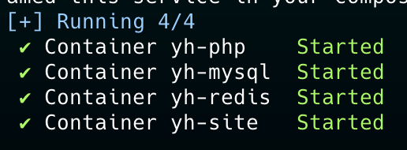
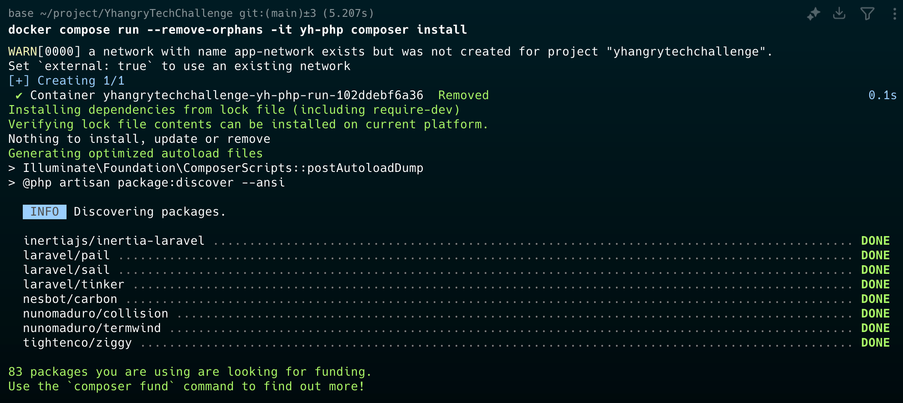
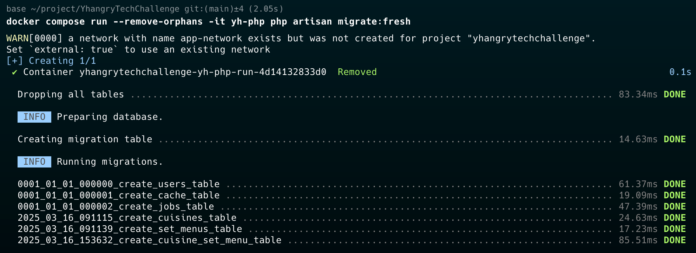
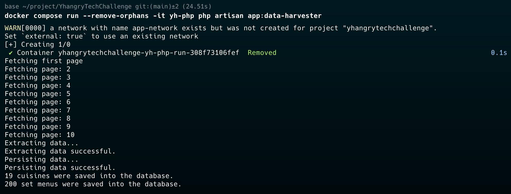
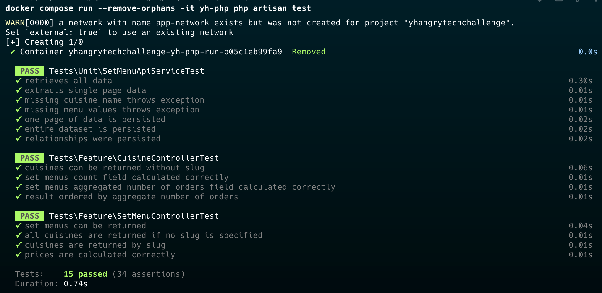
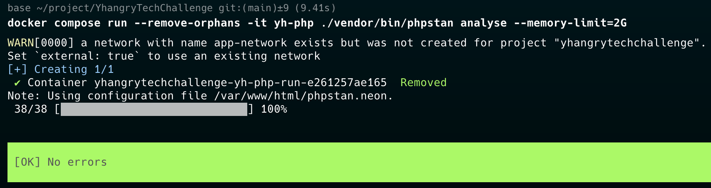
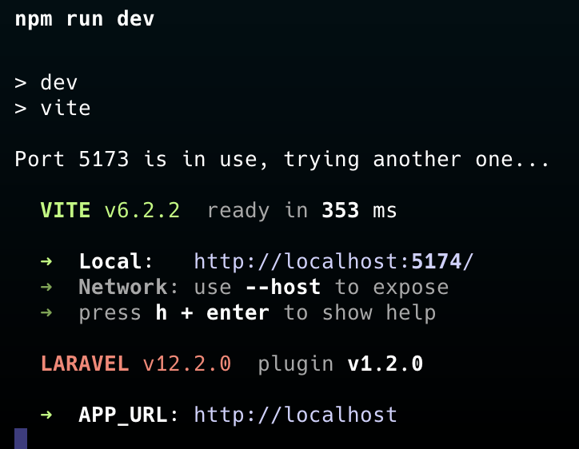

# YHangry Tech Challenge

## Introduction
Thank you for the challenge. I enjoyed working on it.


## Project Setup

The project infrastructure is designed not to assume any pre-installed and pre-configured environment or tools apart from docker.
There is no need to have mysql, php or any web server to be installed on your system.

### The .env file
Please rename the .env.example file to .env

### Docker
- Use the official [guide](https://docs.docker.com/engine/install/) to install docker on your system
- Use the official [guide](https://docs.docker.com/compose/install/) to install docker compose

### Start the containers
```bash
$ docker compose up
```


> In case another service is blocking port 80 on localhost, the container will not start.
> If this happens, please close the process occupying port 80

### Composer packages
Next let's install the composer packages by running composer inside the php container.
```bash
$ docker compose run --remove-orphans -it yh-php composer install
```


### Migrations
Artisan can also run through docker.
Let's run the migrations by executing the following command:
```bash
$ docker compose run --remove-orphans -it yh-php php artisan migrate
```


## Importing the data through the api
The data from the provided api can be imported by running the following command:
```bash
$ docker compose run --remove-orphans -it yh-php php artisan app:data-harvester
```


> The logic is the following:
> 1. The data is fetched going through the pages
> 2. The full set of raw data is processed by parsing and validating, then turned into a collection of DTO classes
> 3. The full parsed dataset is saved into the database as a group query. This way it is much faster and lighter on the database

At the end of the process you'll see all data correctly committed in the local database.

## Testing
Running the tests is also going through Docker to maintain the platform independent design.

### Running the whole test suite
```bash
docker compose run --remove-orphans -it yh-php php artisan test
```


### Grouped tests
You may run unit and end-to-end controller tests in isolation by specifying the group 

```bash
docker compose run --remove-orphans -it yh-php php artisan test --group="set-menu-api-service"
docker compose run --remove-orphans -it yh-php php artisan test --group="cousine-controller"
docker compose run --remove-orphans -it yh-php php artisan test --group="set-menu-controller"
```

#### Test design decisions
The Data Harvesting logic is tested by mocking the third party api layer only.
- The ```SetMenuApiService``` is responsible for fetching one pageful of data at the time.
- The ```ApiDataHandlerService``` is responsible for handling the data returned.

The above services are designed to work in a modular fashion, therefore they are loosely coupled both with each other and also with the rest of the application.
They do not use Model classes, but the database builder class and DTO classes.
This enables faster and easier updates while it can respond to api response payload changes without disturbing any of the core application logic.

The mock ```SetMenuApiService``` has versions for various types of invalid payloads.

## PhpStan
By running the following command:
```bash
docker compose run --remove-orphans -it yh-php ./vendor/bin/phpstan analyse --memory-limit=2G
```
you should see no errors being reported by PhpStan



## Api
The following api endpoints are available

### Get Cuisines
```
    [GET] [APPLICATION_URL]/api/cuisines
```
The endpoint takes no parameters and has the following capabilities:
> - It returns the cuisines in the order of the **total aggregated number of orders** of all associated active set menus
> - It includes both the total number of the associated active set menus and the total order count of them all
> - It includes id, name and slug for all cuisines to be used by the frontend

### Get Set Menus
```
    [GET] [APPLICATION_URL]/api/set-menus/[SLUG (optional)]?page=[PAGE NUMBER]&number_of_guests=[NUMBER OF GUESTS]
```
The endpoint performs the following:
> - Returns a paginated list of active set menus with all required fields
> - Returns a list of cuisines for each
> - If no slug is specified, it returns all set menus

## Frontend
The frontend application is using **Inertiajs** with **React**, **TypeScript** as well as **Redux** for state management. 

### Install the npm packages
```bash
$ npm install
```

### Run the application
```bash
$ npm run dev
```



Once the application is running, navigate to ```http://localhost``` to test the solution.

---

Roland Treiber
